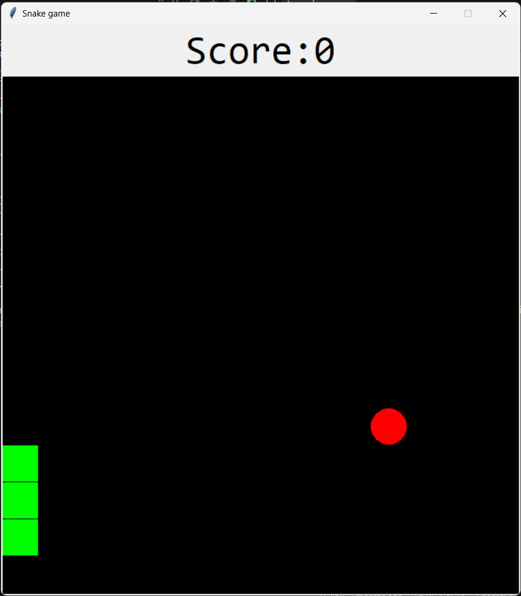
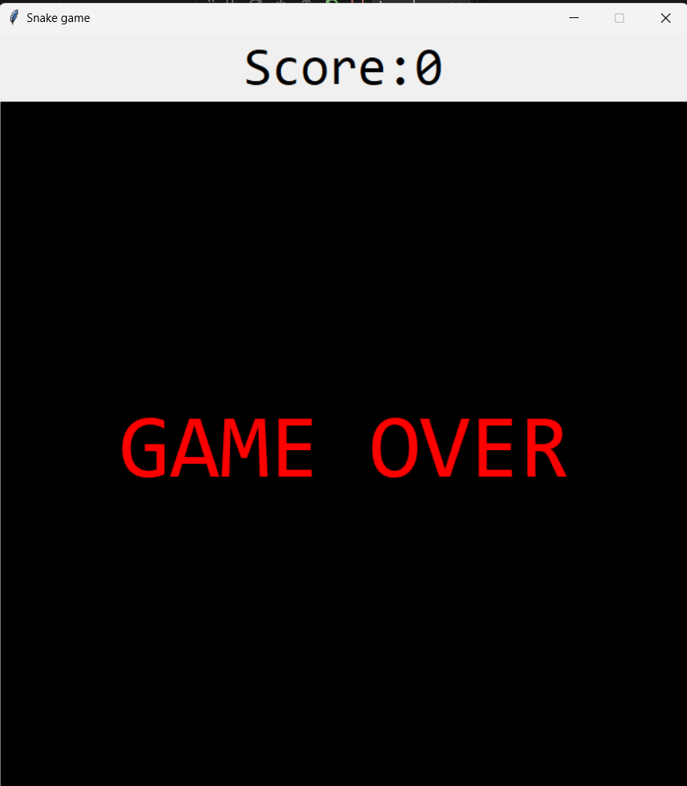

# Snake Game

Welcome to the Classic Snake Game. This project is implemented using Python's Tkinter library.The objective is to control the snake to eat the food and grow in length while avoiding collisions with the walls or the snake's own body.

## Table of Contents

- [Features](#features)
- [Prerequisites](#prerequisites)
- [Installation](#installation)
- [How to Play](#how-to-play)
- [Code Overview](#code-overview)
  - [Key Functions](#key-functions)
- [Screenshots](#screenshots)
- [Contributing](#contributing)
- [License](#license)
- [Acknowledgements](#acknowledgements)

## Features

- Classic snake gameplay
- Simple and intuitive controls
- Automatically restarts after game over
- Score tracking

## Prerequisites

- Python 3.x

## Installation

1. **Clone the repository**

```sh
git clone https://github.com/nayanatara07/Python-Snake-Game.git
cd snake-game
```

2. **Run the game**

```sh
python main.py
```

## How to Play

- **Controls:**
  - Use the arrow keys to change the direction of the snake:
    - Left Arrow: Move Left
    - Right Arrow: Move Right
    - Up Arrow: Move Up
    - Down Arrow: Move Down

- **Objective:**
  - Navigate the snake to eat the red food that appears randomly on the screen. Each time the snake eats the food, it grows in length, and the score increases by one.
  - Avoid colliding with the walls or the snake's own body. If a collision occurs, the game is over, and it will automatically restart after a short delay.

## Code Overview

- **`main.py`**: Contains the main logic of the game, including the Snake and Food classes, game controls, and game loop.

### Key Functions

- `Snake`: Class representing the snake with methods to initialize and update its state.
- `Food`: Class representing the food with methods to initialize and place it randomly on the canvas.
- `next_turn(snake, food)`: Handles the game's logic for each turn, including moving the snake, checking for collisions, and updating the score.
- `change_direction(new_direction)`: Changes the direction of the snake based on user input.
- `check_collisions(snake)`: Checks if the snake has collided with the walls or itself.
- `game_over()`: Handles the game over state and restarts the game after a delay.
- `reset_game()`: Resets the game state to start a new game.


## ScreenShots




## Contributing

Contributions are welcome! If you have any suggestions or improvements, feel free to submit a pull request.

## Acknowledgements

- Thanks to the Tkinter library for providing the tools to create this game.
- Inspired by the classic Snake game from Nokia mobile phones.

---

Enjoy the game and have fun coding! If you encounter any issues or have any questions, please feel free to open an issue or contact me.


